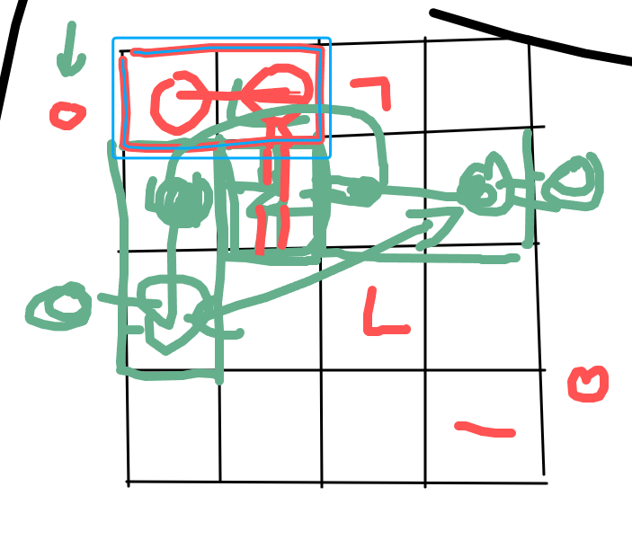

# Power Meaning

- Electricity
- Superpowers
- Politics
- dW/dt (watts [physics power]) 
- Magical/Supernatural powers
- Exponents
- Power from Chainsaw Man

## Phrases
- Horse Power
- Flower Power
- Knowledge is Power
- Drunk with power
- Speak truth to power
- Powers that be
- Power corrupts

# Ideas

## More Rounded Out
- Godzilla game where you destroy a city (maybe something with power grid objectives). You score points by destroying buildings or something. The power to the city could go out when you destroy power stations
- A racing game with horse drawn buggies (Horse Power). Must have drifting. Could include other animal drawn transport like chariots, oxen drawn plows, elephants carrying you in their trunks, and a bear running on it's hind limbs.
- A game where you have the power to spawn flowers (maybe a puzzle platformer [Flower Power]). Could have multiple kinds of plant, like a bouncy flower, elevating flower, slow fall flower. You could also sprout the flowers instead of planting them so it would be like a power up. 
- A horror coded game where you have to keep the lights on by running in a gerbil wheel or maybe collecting batteries. There are npcs that are friendly/helpful until the lights go out where they become shadows of themselves and hunt/harass you. Your goal is to get out of the house or something like that
- A game where you have the ability to press a button that will shock the person in front of you. The more you press it the more painful it becomes. Maybe it's a narrative game where the person is being obnoxious or something but as the game progresses it gets more ambiguous as to whether you should be pressing it. (Like that experiment where the person getting shocked was an actor)
- An fps where you are a robot and have to periodically jump inside of yourself and motivate the gerbil that is powering you. Might involve collecting carrots in the overworld or doing a dancing minigame
- Mining/extraction game where you have to extract resources to power an ever expanding base and yourself (you are a robot or some sort). You spawn with a gerbil and a charging station and must mine coal adjacent materials and iron or something in order to build an electrical system that might connect to more charging stations/teleporter/mining lasers/mine carts/lights/teslacoils/laser turrets. There might also be personal battery upgrades/drill upgrades/personal light upgrades. There could be simple swarming enemies that chase any player made structures near them. There might be variations of enemies ie. explosive enemies.
  1. Implement Character Controls (2 hour)
  1. Add energy grid (wires) placement (4-5 hours)
  1. Attach machines to the grid (2-3 hours)
  1. Create basic enemy (2-3 hours)
  1. Generate Caves (4.5 hours)
  1. Generate Ores (1 hour)
  1. Implement Inventory System (4-5 hours)
  1. PLace initial enemies on map (2 hours)
  1. Create a system for dynamically spawning enemies (6-7 hours)
  1. Implement machines draining energy. (2-3 hours)
  1. Use coal to generate energy (2-3 hours)
  1. Use Iron or whatever to create machines (1-2 hours)
  1. Make mining laser (1 hour)
  1. Make charging station (1 hour)
  1. Character Art (2-3 hours)
  1. Generator Art (1-2 hours)
  1. Rock/Ore Art (2-3 hours)
  1. Enemy Art (1 hour)
  1. Mining Laser Art (1-2 hours)
  1. Charging Station Art (1-2 hours)
  1. SFX (20 hours)

- Puzzle game where you slide around portions of a pcb (or the like) that have plugs for wires. The solution to each puzzle requires position the tiles correctly and then connecting them with the correct wires. Could introduce different gauges of wires. 
- Basically making learn to fly but where you have to punch a sandbag as far as possible. You can have upgrades like a rocket fist, mario triple jump, affirmations, egg jump, equip mjolnir, equip the bliky, rocket jump, pile drive, that thing from zelda where you freeze it and punch it many times, nuke, sticky grenade. You can add upgrades to the dummy, could be c4 that is remotely detonated (player input maybe) or timed, springs. There are different biomes that the dummy flies through, grassy field -> forest -> city -> desert, There might be stratification in the vertical direction. The dummy could have clouds that it bounces off of, and trampolines, donkey that kicks the bag, slide redirect the momentum, land mines. There are challenges that you complete for more money. Get money based on how far you go.

## Kinda weak
- A game where all of your weapons are books (Knowledge is power). 
- Puzzle game with electricity (Batteries, Wires, Gerbils)
  1. You control multiple copies of yourself and you are the wires. When you make a connection you die and respawn to make another connection.
  1. The levels are a micro view of a larger machine. You're trying to repair the big machine by solving each mini puzzle.
- A combat game where you get to choose one power(ability) and have to fight with it the entire round.
- A game about getting as much office work done in as little time as possible. (dW/dt)
- Sisyphus (Work over and over)
- The sand bag mini game from smash but where you have to do really intricate wind up/pump up combos to increase your power. Could be a rhythm game or free style combo game.
- Optimization game where you run a company that hires gerbils to run on treadmills. You have to provide amenities for the gerbils like water coolers and carrots.
- Puzzle platforming game where you play as an appliance that has a limited length on their power cord. You have to utilize outlets, extension cables, power strips to get to the exit.
- A game that involves feeding an every more hungry furnace with some fuel